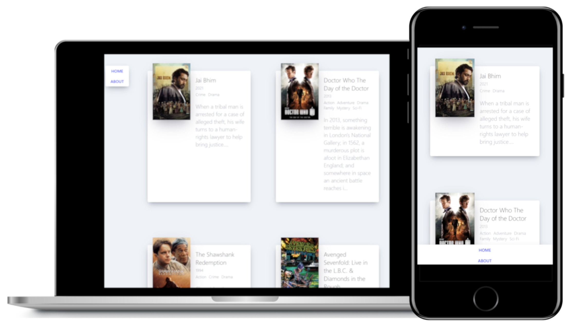

# Movie App 2021

영화 정보를 받아와서, 카드 형태로 뿌려주는 앱

## 주요기능
* 영화 API로부터 평점 높은 영화들의 정보를 받아, 화면에 출력
  * https://yts.mx/api/v2

### 개발기간 🏗️
* 2021.12.07
   
### 기술 📚
* Lang
  * JavaScript
* FE
  * React
  * React-router
  * axios
* Bundling
  * Webpack

### 빌드 방법 👷‍♂️
* ```zsh
  $ yarn
  $ yarn build
  ```
  빌드 결과물은 build 디렉토리에 생성
